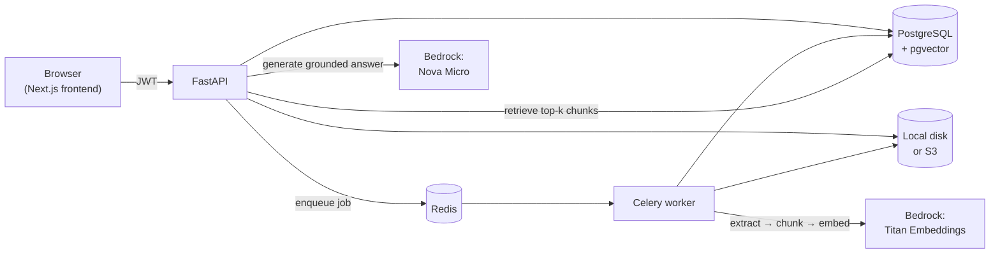

# AI PDF Chatbot

[](https://github.com/sagrawal486/PDFChatBot/actions/workflows/ci.yml)

Upload a PDF, then ask questions about it. Answers are grounded in your own
documents and cite the exact page they came from — this is a
retrieval-augmented generation (RAG) app, not a general chatbot answering from
memory.

Full-stack: FastAPI backend, Next.js frontend, Celery background processing,
PostgreSQL + pgvector for retrieval, and Amazon Bedrock for embeddings and
chat. Runs entirely for free with zero AWS setup (`docker compose up`), with
AWS as an opt-in, one-env-var upgrade.

**For the "why" behind every decision here** — tech stack choices, chunking
strategy, every cost-control setting explained, and a few real bugs found and
fixed along the way with the full investigation — see
[`docs/DESIGN_DECISIONS.md`](docs/DESIGN_DECISIONS.md). This README is the
"how to run it"; that doc is the "why it's built this way."

## Features

- JWT authentication (register / login / current user)
- PDF upload with validation, stored locally or in S3
- Background processing with Celery + Redis: text extraction → page-aware
  chunking → embeddings, with documents moving through
  `uploaded → processing → ready`/`failed`
- Retrieval-augmented answers via Amazon Bedrock (Nova Micro), grounded
  strictly in the caller's own documents, with citations (document, page
  number, similarity score, excerpt) — or a free `simple` mode that needs no
  AWS account at all
- Vector search via PostgreSQL + pgvector (HNSW index), ranked in the
  database, not in application code
- Per-user cost/abuse controls: max chunks embedded per document, concurrent
  (not sequential) embedding calls, and a daily cap on questions answered
- Full CRUD on documents (upload, list, get, delete), all owner-scoped
- Next.js frontend: auth, document upload with live status, and a chat UI
  with citations
- Docker Compose runs the whole stack (Postgres, Redis, API, worker) with one
  command; CI runs the test suite and a Docker build on every push

## Architecture



```
app/
  api/            HTTP routers (auth, users, documents, questions, health)
  auth/           Auth dependencies (get_current_user)
  core/           Settings, JWT, password hashing
  db/             Engine/session setup
  models/         SQLAlchemy models (User, Document, DocumentChunk, QuestionLog)
  repositories/   Database access
  schemas/        Pydantic schemas
  services/       Business logic: documents, PDF processing, embeddings,
                  retrieval, RAG, storage (local/S3), chat providers, usage limits
  tasks/          Celery tasks
  worker.py       Celery app
migrations/       Alembic migrations
tests/            Pytest suite (87 tests, no AWS/network needed)
docker/           Dockerfile + docker-compose (full stack)
frontend/         Next.js app (App Router, TypeScript, Tailwind)
docs/             Design decisions, trade-offs, and a debug-mode walkthrough
```

## Quick start (Docker, no AWS needed)

```bash
git clone https://github.com/sagrawal486/PDFChatBot.git
cd PDFChatBot
cp .env.example .env
# Edit .env: set JWT_SECRET_KEY to a real random value, e.g. `openssl rand -hex 32`.
docker compose -f docker/docker-compose.yml up --build
```

That's it — Postgres (with pgvector), Redis, the API, and the worker all
start together; the API container applies migrations automatically. API:
http://localhost:8000/docs.

Defaults (`CHAT_PROVIDER=simple`, `STORAGE_BACKEND=local`) need no AWS
account: uploaded PDFs are chunked and searchable, but "answers" are the
retrieved text itself rather than an LLM-generated summary. See
[Enabling Bedrock](#enabling-bedrock-real-generated-answers) below to turn
that into real synthesized answers.

For the frontend, in a separate terminal:

```bash
cd frontend
npm install
cp .env.local.example .env.local
npm run dev
```

Open http://localhost:3000.

## Manual setup (local development, no Docker for the app itself)

```bash
python -m venv venv
venv\Scripts\activate            # Windows
# source venv/bin/activate       # macOS/Linux
pip install -r requirements-dev.txt

docker compose -f docker/docker-compose.yml up -d postgres redis
cp .env.example .env    # edit JWT_SECRET_KEY at minimum
alembic upgrade head
```

Then, in separate terminals:

```bash
uvicorn app.main:app --reload
celery -A app.worker.celery_app worker --loglevel=info --pool=solo   # --pool=solo is recommended on Windows
```

VS Code users: `.vscode/launch.json` has ready-made debug configs for both —
see [`docs/DESIGN_DECISIONS.md` §12](docs/DESIGN_DECISIONS.md#12-how-to-actually-learn-the-code-by-running-it-not-just-reading-it)
for a guided walkthrough of tracing a real request through every layer with
breakpoints.

## Environment variables

All settings, defaults, and what needs AWS vs. what doesn't are documented in
[`.env.example`](.env.example) (backend) and
[`frontend/.env.local.example`](frontend/.env.local.example). The short
version: everything defaults to free/local, and every external dependency
(chat, embeddings, storage) is swappable via one env var without touching
code.

### Enabling Bedrock (real generated answers)

```env
CHAT_PROVIDER=bedrock
CHAT_MODEL_ID=apac.amazon.nova-micro-v1:0   # region-specific inference profile -- see below
```

Requires AWS credentials (CLI profile, env vars, or an IAM role) with Bedrock
access, and model access granted for Nova Micro and Titan Text Embeddings V2
in your region ([AWS Console → Bedrock → Model access](https://console.aws.amazon.com/bedrock/)).

Some Bedrock models (Nova included) reject on-demand invocation by their bare
model ID in most regions — you need a region-specific **cross-region
inference profile** ID instead. Find yours with:

```bash
aws bedrock list-inference-profiles --region <your-region> \
  --query "inferenceProfileSummaries[?contains(inferenceProfileId,'nova-micro')].inferenceProfileId"
```

(`apac.*` for regions like `ap-south-1`, `us.*`/`eu.*` elsewhere.) See
[`docs/DESIGN_DECISIONS.md` §5](docs/DESIGN_DECISIONS.md#5-the-chatanswer-step)
for the full story on this, including a first fix attempt that didn't work.

Set an AWS Budget alarm before enabling this — costs are small but real.

## API

| Method | Path              | Auth | Description                          |
| ------ | ----------------- | ---- | ------------------------------------ |
| GET    | `/health`         | –    | Health check                         |
| POST   | `/auth/register`  | –    | Create an account (JSON: `name`, `email`, `password`) |
| POST   | `/auth/login`     | –    | Form login (`username`, `password`), returns a bearer token |
| GET    | `/users/me`       | ✔    | Current user                         |
| POST   | `/documents`      | ✔    | Upload a PDF (multipart `file`); queues background processing |
| GET    | `/documents`      | ✔    | List the caller's documents          |
| GET    | `/documents/{id}` | ✔    | Get one document (404 if not owned)  |
| DELETE | `/documents/{id}` | ✔    | Delete a document and its file       |
| POST   | `/questions`      | ✔    | Ask a question, body `{"question": "..."}`; 429 past the daily limit |

Example:

```bash
TOKEN=$(curl -s -X POST localhost:8000/auth/login -d "username=me@example.com&password=secret" | jq -r .access_token)
curl -X POST localhost:8000/documents -H "Authorization: Bearer $TOKEN" -F "file=@paper.pdf"
curl -X POST localhost:8000/questions -H "Authorization: Bearer $TOKEN" \
     -H "Content-Type: application/json" -d '{"question": "What is the main conclusion?"}'
```

`/questions` returns:

```json
{
  "answer": "…",
  "citations": [
    {"document_id": 8, "chunk_index": 1, "page_number": 1, "score": 0.55, "excerpt": "…"}
  ]
}
```

## Testing

```bash
pytest -q
```

87 tests, ~2-3 seconds, no AWS credentials or network access needed — every
external boundary (database, S3, Bedrock, Celery) is a small `Protocol`
satisfied by a hand-written fake in tests. See
[`docs/DESIGN_DECISIONS.md` §10](docs/DESIGN_DECISIONS.md#10-testing-approach)
for the trade-offs of that approach, including a real bug it initially missed.

## What's next

- Streaming answers, conversation history
- A PDF viewer with click-a-citation-to-jump-to-page
- Deployed demo (single EC2 + Docker Compose + S3 + Bedrock)

See [`CLAUDE.md`](CLAUDE.md) for the full roadmap and standing project
decisions.
